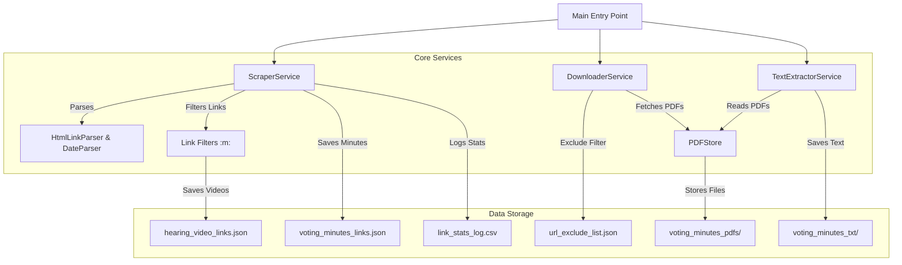

# Licensing Board Scraper

A robust, object-oriented Python application that scrapes video links, and voting minutes from the Boston Licensing Board website, with built-in support for content downloading, PDF validation and processing, text extraction, deduplication monitoring, and edge case managemnt for exception pdfs.

See the [Scraper Design Rationale](./docs/Scraper_Design_Rational.md) for an explanation of the design decisions behind this approach.

## 🏗️ High-Level Architecture

The project utilizes a modular, **service-based architecture** to ensure maintainability and separation of concerns.

### ⚙️ Services Process Flow

**Scraper Service**: 1. Use *LinkParser* to read all links on the page, 2. Runs *Filter Links* to remove known NON PDF links, 3. Save PDF links (aka Meeting Minutes)), 4. Create a summary stats log

**Download Service**: 1. Loads and iterates on voting minutes links, 2. Downloads PDF based on URL (w/ google.drive handler) 3. Tests URL for exclude list qualification. 4. Download PDF Exceptions

**TextExtractor Service**: 1. Read voting_miniutes_pdfs directory, 2. Write PyMuPDF striped text to voting_minites_txt



### 🧩 Major Classes

* **`ScraperService`**: The conductor of the scraping orchestra. It fetches the web page, coordinates parsing, applies filters, and saves structured metadata to JSON.
* **`DownloaderService`**: management of file retrieval. It handles the downloading of PDFs, integrates with Google Drive links, and uses `PdfRepository` to ensure only unique content is saved (deduplication via hashing).
* **`TextExtractorService`**: A post-processing service that converts the downloaded PDFs into raw text files using `PyMuPDF` for easier downstream analysis.
* **`VideoLinkFilter`**: A specialized filter that intercepts YouTube/video links, saves them to their own dataset, and removes them from the primary processing pipeline.
* **`PDFStore`**: A robust storage handler that manages file versioning. If a file with the same name but different content is downloaded, it automatically increments a version suffix (e.g., `_v2.pdf`).

## 🚀 Setup & Installation

### Prerequisites

* **Python 3.13+**
* **macOS / Linux** (Recommended for `dev_setup.sh`)
* **uv** (Optional, but recommended for fast dependency management)

### Quick Start (macOS /Linux)

We have provided a convenience script to set up the environment automatically. It uses `uv` to manage the virtual environment and dependencies.

```bash
./dev_setup.sh
```

### Manual Setup (Windows / Standard Pip)

If you prefer not to use `uv` or are on a different OS, you can use standard Python tooling:

1. **Create a Virtual Environment**:

   ```bash
   python -m venv .venv
   source .venv/bin/activate  # On Windows: .venv\Scripts\activate
   ```
2. **Install Dependencies**:

   ```bash
   pip install -r requirements.txt
   ```

## 🏃 Usage

The application is designed to be run as a single module. This triggers the entire pipeline: Scraping -> Downloading -> Extraction.

```bash
# Activate the virtual Environment
source .venv/bin/activate

# Using uv
uv run python -m app.main

# OR using standard python (with venv activated)
python -m app.main
```

If you have `make` installed, you can also use the following commands:

```bash
# Sync all dependencies
make dev

# Run the application
make run

# Run linting and type checking
make lint
```

### Outputs

* `data/url_exclude_list.json`: List of URLs to exclude from scraping. (Updated by the DownloaderService if Link is not a PDF)
* `data/hearing_video_links.json`: Collection of extracted YouTube/video links.
* `data/voting_minutes_links.json`: Collection of voting minute PDF links. (With common date format parsed from href & body)
* `data/link_stats_log.csv`: Historical record of scraping statistics.
* `voting_minutes_pdfs/`: The downloaded PDF files. (Detects duplicates, versions files when content differs, and skips identical files.)
* `voting_minutes_txt/`: Text extracted from the PDFs.
