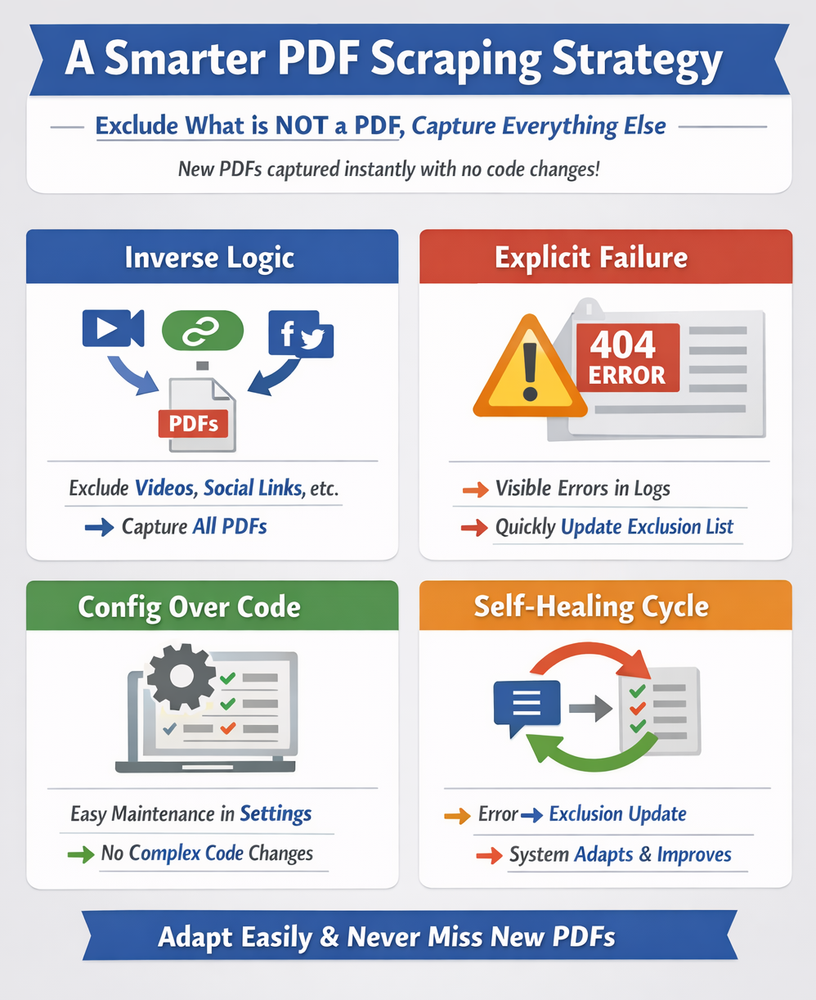

# Design Rationale: A Simple and Robust PDF Scraping Approach

## Overview

A deliberately simple and resilient approach to scraping PDF documents from the Boston Licensing Board website. Instead of trying to predict or pattern-match which links *should* be PDFs, the scraper focuses on reliably collecting all available links and then removing those that are known **NOT** to be PDFs.

This design minimizes assumptions about how the site structures its URLs and reduces the need for ongoing code changes as the site evolves.

## How the Scraper Works

The scraper follows a straightforward process:

1. **Collect all URLs** from the Licensing Board’s main page
2. **Remove URLs that are known not to be PDFs** using a maintained exclusion list
3. **Treat the remaining URLs as PDF candidates** for further processing and curation

At this point, only links that are expected to represent meeting minutes or related PDF documents remain.

## Core Assumption

The approach is based on a simple and practical assumption:

> Every URL on the page falls into one of two categories:
>
> * It is a PDF URL
> * It is not a PDF URL

This binary view allows the scraper to behave predictably even as new links appear on the site.

## Why This Approach Is More Robust

### Handling New URLs Gracefully

When a new URL is added to the page:

* **If it is a PDF**
  → It is automatically included, with **no code changes required**.
* **If it is not a PDF**
  → An attempted PDF download will fail, making the issue immediately visible (in the logs).
  → The URL is then added to the exclusion list, self-healing the scraper on future runs.
  → The scraper continues to function correctly without modifying scraping logic.

### Avoiding Silent Failures

An alternative approach—writing code to detect “PDF-looking” URLs—requires encoding assumptions about URL structure, naming conventions, or patterns. This creates risk:

* If the site introduces a valid PDF that does **not** match the coded rules
* The PDF will be silently skipped
* No error is raised, and missing data may go unnoticed for some time

Fixing this requires manual investigation and a subsequent code change.

By contrast, the exclusion-based approach favors visible failures and configuration updates over silent data loss.

## Summary

Removing known non-PDF links rather than trying to detect PDFs directly:

* Allows PDF URLs to change freely without breaking the scraper
* Avoids fragile, pattern-based logic
* Shifts maintenance from code to simple configuration
* Makes missing or unexpected URLs easier to notice and correct

Overall, this strategy prioritizes clarity, resilience, and long-term maintainability while keeping the scraping logic intentionally simple.
